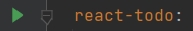
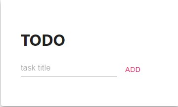
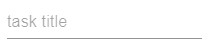
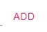
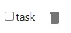
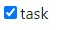

# Todo App for create a tasks list.
***
## To start you need:

> 1. Make clone the repository
[Todo](https://github.com/It-Shu/testovoe)
> 2. Open the project with some code editor
***

# If yor use a Docker: 

>Open a docker-compose.yml file
> 
> > Run the docker compose
> >
> >
> 
> Open [http://localhost:3000](http://localhost:3000) to view it in the browser.


# For developer mode:
## To install and save in your package.json dependencies, run:
_with yarn:_
```
yarn 
```
_with npm:_
```
npm install 
```

***
## You can run the project use:
_with yarn:_
```
yarn start
```
_with npm:_
```
npm start 
```

Runs the app in the development mode.\
Open [http://localhost:3000](http://localhost:3000) to view it in the browser.
***

## Now you can use the app



***

>1. if you need create task use the input



>2. to add task use the button "ADD"
>
>> you can`t add task if task title length more 5 symbols or equal 0



> Now you create task



>3. if you want to mark task as completed, click on the task title or use checkbox



>4. you can remove task, use the delete button

